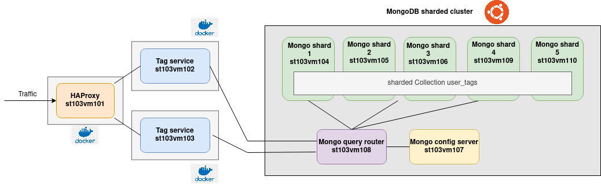
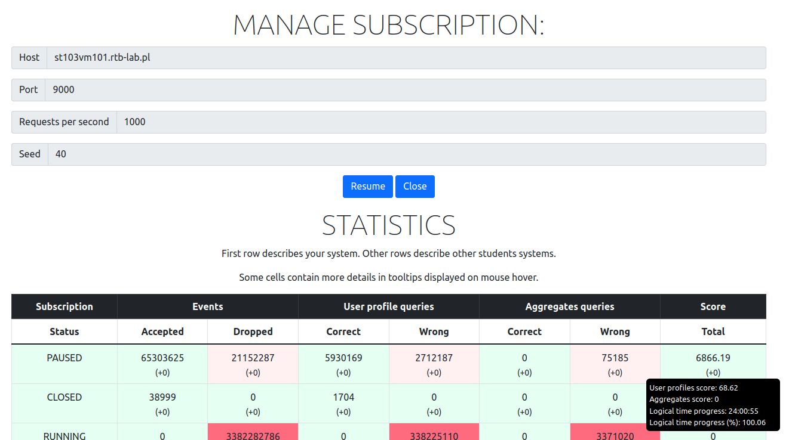
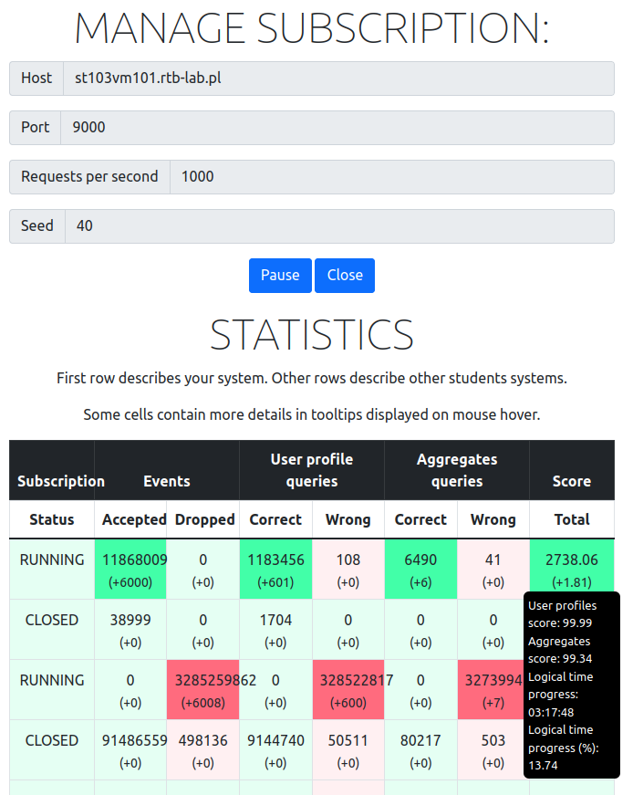

# mimuw-project

Project for `Practical Distributed Systems` course by `Ivo Christ`.

## System architecture

### Components

- HAProxy load balancer run as docker container
- Two instances of tag-service run as docker container
- MongoDB sharded cluster
  - One mongo query router
  - One mongo config server
  - Five mongo shards over which the `user_tags` are distributed

### Notes about system architecture

- Every component can be scaled horizontally
- MongoDB can be scaled horizontally by adding more shards
- In a production environment the query router and config server should be replicated for better availabilty of the MongoDB cluster
- Deployment is partially automated using `Ansible` in the folder `deployment`

### Notes about the implementation

The `tag-service` handles all three use cases. The only data which is stored permamently are the `user_tags` from use case 1. The `user_profiles` from use case 2 and the `aggregations` from use case 3 are queried from the database cluster ad-hoc and transformed into the specified data structure.

The `tag-service` was implemented using the Go programming language and the [Go fiber framework](https://gofiber.io/). Use case 3 aggregations are calculated ad-hoc, instead of precomputing them. Additionally, this makes the system architecture a lot simpler as no event-streaming with Kafka and the precomputation of aggregations is needed.

In terms of performance the sharded MongoDB cluster proved to be the bottleneck and thus should be scaled up first when targeting an ever higher traffic load for the system. The `tag-service` itself can handle the load quite well and even one instance of the service would be enough to handle 1000 req/sec from the testing platform. Most of the time the tag-service is waiting for a response from the database and the actual work from the services itself is negligible in terms of needed time. Though, for better availabilty the load is balanced between two instances of the service.

When running an experiment using the testing platform, at some point in the progression the data load is too big for the database and all queries take too long time and thus slow down every request and missing the timeout window. This is further discussed in the result section down below.

## Result from testing platform

### Performance **without use case 3**

This picture shows the final score after 24 hours with only use case 1 and use case 2. Until about 70% of logical time progress, the system had a user profile score of **99.99** and thus handling almost all requests perfectly fine. Then the load became too big for the database and the queries slowed down by a lot. The response times went from 1ms for creating a user tag to almost 1 second and the user profiles from steady 10ms to 100ms depending on the query to multiple seconds. This drastic increase seems abnormal, but I could not find the reason for this abnormal behavior. In the rest of the logical time progress the score deteriorated to **68.62**. I tried to improve the database performance by scaling even up to five shards on separate machines, which should handle this load in theory. A possible issue could be that the mongo query router is not replicated. The query router is the single point of access from all services requesting something from the database cluster and the query router then requests the data from the shards. The query router could be overwhelmed and in production environment there should be a query router per service. Although, the CPU and RAM usage was never that high for the machine of the mongo query router.

### Performance **with use case 3**

This picture shows the progress **with use case 3** until about 13% of logical time progress. In practice, the system can handle use case 1,2 and adh-hoc calculations of use case 3 until about 20% of logical time progess. Before that threshold the user profiles and aggregations were **99.99** and would solve almost all queries correctly and in time. The aggregations worked surprisingly well and were finished in a time range of 1-5sec. Again, most of the time comes from waiting for the database to finish the query. But after about 20% logical time progress the load became too big for the database and it slowed down dramatically similar to the case without use case 3 at 70% progress. Especially the adh-hoc aggregations blocked the database for a long time, as the scanning and filtering of all documents (which are in the millions at that point) for an aggregations took more than one minute and this triggered an timeout. Additionally, these long aggregations slowed down the other queries as well and led to their timeouts. I never ran the testing platform until 100% progress, because I could already see the system can not recover from this behavior anymore with ad-hoc aggregation calculation.

### Ideas for optimization

I had some ideas to improve the effiecieny of querying the database, which was the bottleneck for the whole system.

- Aggregation caching

  The ad-hoc aggregations are not saved after the query. But for better performance, in case the same aggregation gets queried again, the aggregation results could be cached in some distributed key-value storage like `Redis`. Reading an already computed aggregation would save an immense amount of time. I logged what kind of aggregations were queried over time and unfortunately they rarely repeated themselves, making this caching strategy useless for this use case.

- Optimizing MongoDB queries by indexing

  The biggest issue in the database was that at some point there were millions of documents saved, which all had to be scanned for every request to the database, when requesting some filtered data for user profiles or aggregations. In theory, this can be optimized by [indexing](https://www.mongodb.com/docs/manual/indexes/) the documents in a collection in MongoDB. Indexes are a special data structure, which are far more efficient to query than scanning a whole collection. In the sharded cluster setup the documents (user_tags) are already indexed and distributed among the shards by their `cookie` field. I created additional indexes on fields like `time`, `origin` and `product_info` which are queried a lot in the use cases. Although, this should improve the performance a lot in theory, it did not improve the response time in practice by much. Therefore I was unfortunately not able to improve the database bottleneck.

## Deployment

The deployment is partially automated using `Ansible`. All the configuration files and playbooks can be found in the `deployment` directory. The biggest challenge in deployment is the MongoDB cluster as it requires a lot of configurations. The provided ansible playbook does not work completely as there are some issues when accessing the internal mongo shell itself. Other than that every component can be deployed by playbooks in automated way.

For further information, the concrete steps for deployment are documented in another [document here](deployment/ansible/setup.md).

The status of the system can be seen in the HAproxy frontend at [http://st103vm101.rtb-lab.pl:10000/](http://st103vm101.rtb-lab.pl:10000/).
