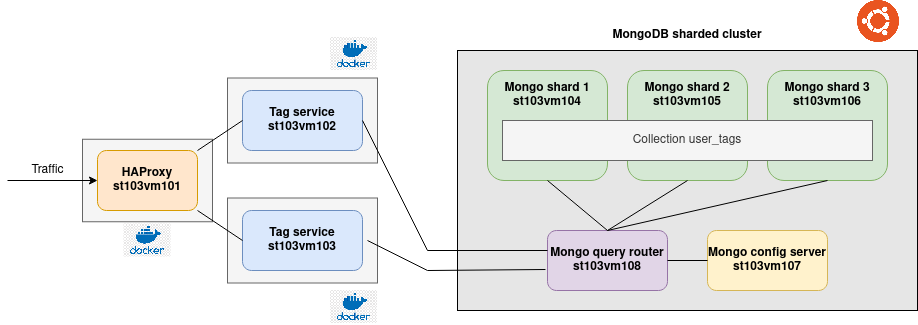
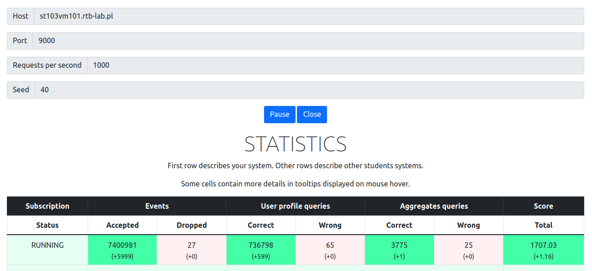

# mimuw-project

Project for `Practical Distributed Systems` course by `Ivo Christ`.

## System architecture

### Components

- HAProxy load balancer run as docker container
- Two instances of tag-service run as docker container
- MongoDB sharded cluster
  - One mongo query router
  - One mongo config server
  - Three mongo shards over which the `user_tags` are distributed

### Notes about system architecture

- Every component can be scaled horizontally
- MongoDB can be scaled horizontally by adding more shards
- In a production environment the query router and config server should be replicated for better availabilty of the MongoDB cluster
- Deployment is automated using `Ansible` in the folder `deployment`

### Notes about the implementation

The `tag-service` handles all three use cases. The only data which is stored permamently are the `user_tags` from use case 1. The `user_profiles` from use case 2 and the `aggregations` from use case 3 are queried from the database cluster ad-hoc and transformed into the specified data structure.

The `tag-service` was implemented using the Go programming language and the [Go fiber framework](https://gofiber.io/). The implementation in Go proved to be so efficient and the sharded MongoDB cluster fast enough that the aggregations from use case 3 can be calculated ad-hoc before the timeout of the request occurs. Additionally, this makes the system architecture a lot simpler as no event-streaming with Kafka and the precomputation of aggregations is needed.

The ad-hoc aggregations are not saved after the query. But for better performance, in case the same aggregation gets queried again, the aggregation results could be cached in some distributed key-value storage like `Redis`.

In terms of performance the sharded MongoDB cluster is the bottleneck and thus should be scaled up first when targeting an ever higher traffic load for the system. The `tag-service` itself can handle the load quite well and even one instance of the service would be enough to handle 1000 req/sec from the testing platform. Though, for better availabilty the load is balanced between two instances of the service.

## Result from testing platform

